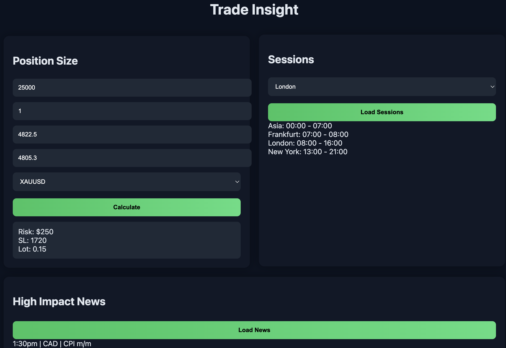

# Trade Insight

Trade Insight is a trading helper tool built with Java and Spring Boot.

It helps with:
- position size calculation
- high impact news
- trading sessions by timezone

## Demo

## Features

- Position Size Calculator
- High Impact News Scraper
- Trading Sessions with Timezone Selection
- REST API
- Simple Frontend

## Disclaimer

This project is for educational and demonstration purposes only.

All calculations, news data, and session times are provided as-is and may not be fully accurate.

Trading involves risk. You are fully responsible for your own trading decisions and should always double-check all data before executing any trades.